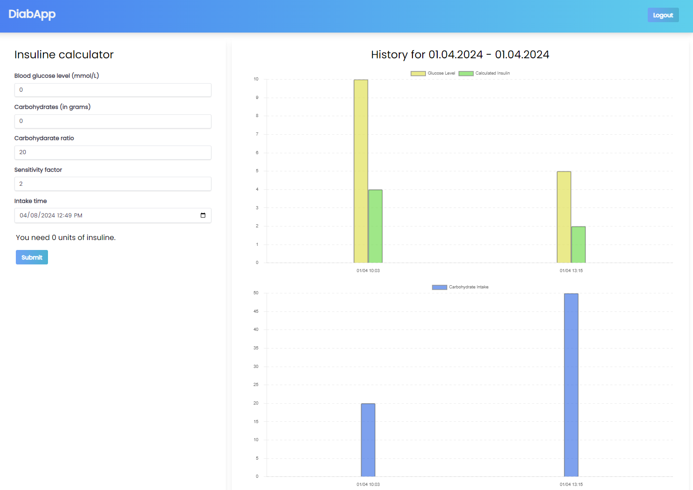

# A simple web application for calculating insuline dosages, for demo only, not for treatment decisions of any kind!

This simple web app calculates insuline dosages based on current measured blood glucose level (mmol/l), carbohydrate intake (grams), personal insuline sensitivity factor and carbohydate factor (insuline to carb ratio). It stores previously used values to a PostgresSQL database. The app is currently meant to either run in development mode locally or from a pair of Docker containers for the server and the Postgresql (see: https://cygnusx1.mywire.org). A docker compose file is used to set up the service with both containers. This way of running PostgreSQL is of course meant for a small scale demo app only and not for real production use.

The frontend (see figure 1) has been coded with Typescript, Tailwind CSS, React, while using some additional packages for form handling, such as React Hook Form and Yup. State management is impelemted with the help of Zustand. The backend has been coded with Typescript and Node.js. Prisma ORM is used to connect to the PostgreSQL database. The app uses basic password authentication.

The docker compose & Docker file combo uses environment variables, which need to be defined in .env files in the main directory and in the client subdirectory so that the following variables correspond to one's installation:

- DATABASE_URL, this refers to the database running in the container, for example "postgresql://postgres:postgrespassword@db:5432/diabapp?schema=public"
- SECRET, this is the web token secret, for example "dfsalkhgdsf_23p0"
- PORT, this is the server listening port, for example: 8080
- VITE_API_URL, this is the url the client tries to connect to and needs to be available also in the client .env file, it needs the /api part, for example "https://myserver.com/api"

 

<figure>
  
  <figcaption>Figure 1. DiabApp UI</figcaption>
</figure>

 

# Current limitations

- The data display history scrolling has not been implemented yet.
- Data display enhancements for smaller display pending.
- Updating tests pending.
